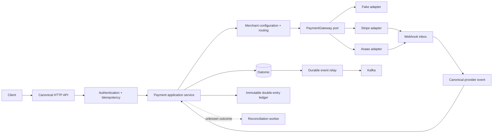

# Payment Orchestrator in Clojure

A provider-agnostic payment orchestration API in Clojure and Datomic: consumers use one canonical contract while payment state, idempotency, and financial rules remain independent of Stripe or Asaas.

## Why this project exists

- **Multiple providers?** The HTTP API and payment model are canonical; Fake, Stripe, and Asaas sit behind the `PaymentGateway` port.
- **Provider timeout?** A timeout is not assumed to be a failed payment. Ambiguous outcomes are reconciled before a dangerous retry.
- **Duplicate charge?** `Idempotency-Key` is persisted with the payment command, so equivalent retries replay the original result and conflicts are rejected.
- **Financial integrity?** Settled payments create immutable, balanced double-entry ledger postings.
- **Real integrations?** The project includes deterministic Fake-provider tests plus Stripe and Asaas sandbox adapters and documented sandbox validation.



The diagram shows reconciliation only for unknown outcomes, and Kafka only after durable Datomic state through the relay. Provider adapters depend on the canonical application boundary—not the other way around.

## Core guarantees

- Provider-agnostic payment domain and public API
- Idempotent payment creation and duplicate-safe webhook inbox
- Explicit unknown-outcome handling and reconciliation
- Immutable double-entry ledger with balance invariants
- Durable, at-least-once event publication from the Datomic log

## Providers and payment methods

- Fake provider for deterministic tests and failure injection
- Stripe Sandbox and Asaas Sandbox adapters behind the same port
- Card, Pix canonical QR/copy-and-paste actions, and Boleto vouchers
- Merchant-scoped provider accounts and routing without provider fields in consumer requests

## Evidence

Latest validated local suites:

| Suite | Tests | Assertions | Failures | Errors |
| --- | ---: | ---: | ---: | ---: |
| Unit | 109 | 344 | 0 | 0 |
| Integration | 31 | 92 | 0 | 0 |

## Quick Start

### 1. Configure and start

```powershell
Copy-Item .env.example .env
docker compose up --build
```

The local stack starts the API, Kafka, Prometheus, and Grafana. Keep credentials only in `.env`; it is ignored by Git.

### 2. Create a payment

Replace the placeholder with your local API key from `.env`:

```powershell
curl.exe -X POST http://localhost:8080/v1/payments `
  -H "Authorization: Bearer <PAYMENT_ORCHESTRATOR_API_KEY>" `
  -H "X-Merchant-Id: demo-merchant" `
  -H "Content-Type: application/json" `
  -H "Idempotency-Key: demo-payment-001" `
  -d '{"customerId":"cust-demo","amount":12990,"currency":"BRL","method":"card"}'
```

### 3. Test and demo

```powershell
docker run --rm -v "${PWD}:/workspace" -w /workspace clojure:temurin-21-tools-deps clojure -M:test
docker run --rm -v "${PWD}:/workspace" -w /workspace clojure:temurin-21-tools-deps clojure -M:test-integration
```

Follow the [demo script](docs/DEMO.md) for provider replacement, idempotency, duplicate webhooks, Datomic time travel, reconciliation, ledger, and Kafka relay.

## Deep dives

- [Architecture](docs/ARCHITECTURE.md)
- [API contract](docs/API.md)
- [Multi-tenancy and routing](docs/MULTI-TENANCY.md)
- [Observability](docs/OBSERVABILITY.md)
- [Demo](docs/DEMO.md)
- [Architecture decisions](docs/adr)
- [Security policy](SECURITY.md)
- [Release notes](docs/RELEASE-NOTES-v1.0.0.md)

## License

Distributed under the MIT License. See [LICENSE](LICENSE).
