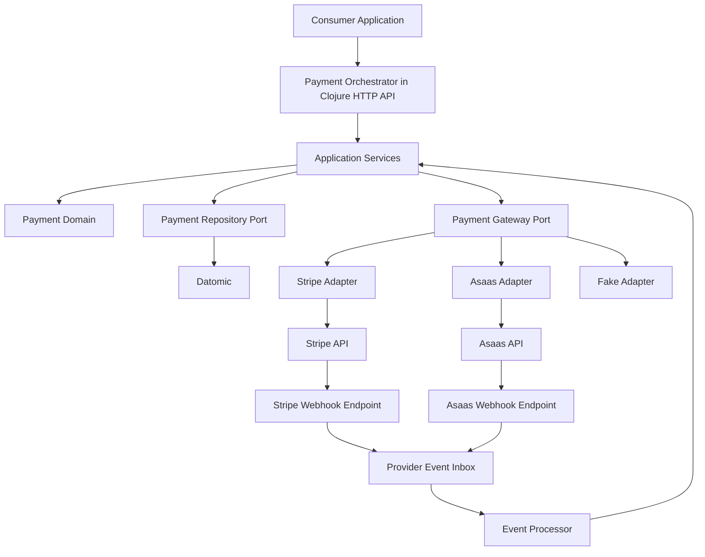
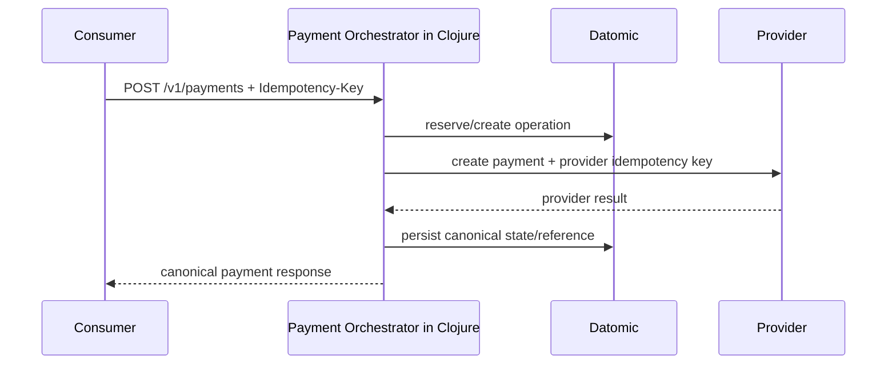
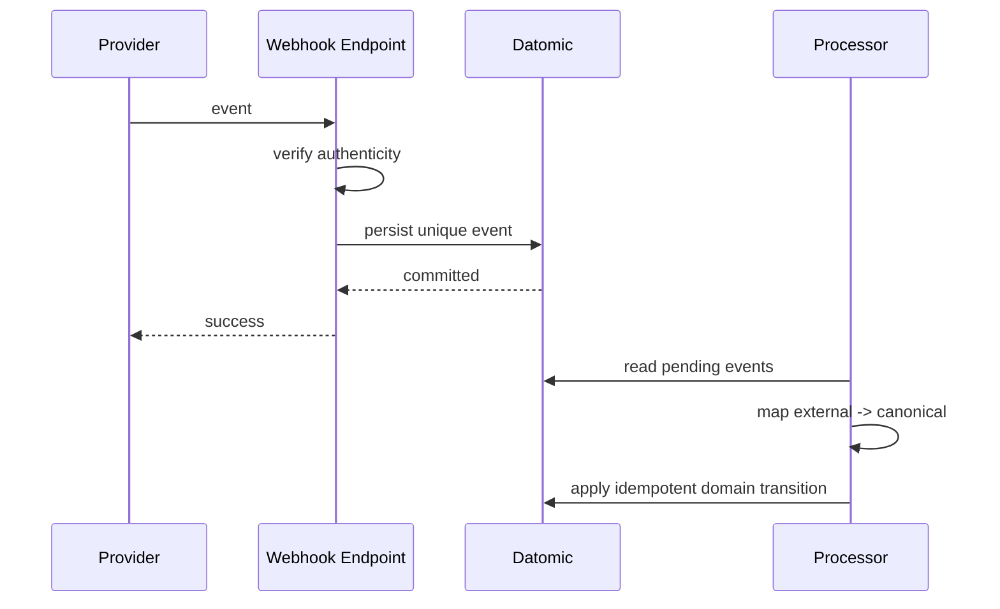

# Payment Orchestrator in Clojure — Arquitetura

## 1. Drivers arquiteturais

### Driver A — Provider independence

Trocar provider não deve alterar consumidores.

### Driver B — Financial correctness

Duplicação, timeout e retry não podem causar cobranças acidentalmente duplicadas.

### Driver C — Auditability

Toda mudança de estado relevante precisa ser explicável posteriormente.

### Driver D — Evolução incremental

O sistema precisa continuar executável durante todo o desenvolvimento.

### Driver E — Testability

Regra de negócio não deve depender de rede, framework HTTP ou banco para ser testada.

---

# 2. Arquitetura lógica



---

# 3. Dependency rule

Dependências devem apontar para dentro.

```text
Infrastructure
    |
Application
    |
Domain
```

O domínio não importa:

```text
stripe
asaas
reitit
datomic
kafka
```

---

# 4. Módulos

```text
payment_orchestrator_clj/
  payment/
  ledger/
  provider/
  webhook/
  datomic/
  api/
  event/
  reconciliation/
  observability/
```

Cada pasta representa uma responsabilidade clara.

---

# 5. Domain vs Application

## Domain

Decide:

```text
payment transition allowed?
refund amount valid?
journal balanced?
```

## Application

Orquestra:

```text
load payment
call provider
apply domain decision
persist
emit marker/event
```

Exemplo conceitual:

```clojure
(defn pay! [{:keys [payments gateway clock]} command]
  (let [payment (domain/new-payment command)
        external-result (provider/create-payment! gateway payment)
        updated (domain/apply-provider-result payment external-result)]
    (repo/save! payments updated)
    updated))
```

O código real precisará de decisões transacionais mais cuidadosas, mas a separação mental permanece.

---

# 6. Anti-Corruption Layer

Cada provider possui mapper próprio.

```text
Stripe Payload
    |
    v
Stripe Mapper
    |
    v
Canonical Provider Result
```

E:

```text
Asaas Payload
    |
    v
Asaas Mapper
    |
    v
Canonical Provider Result
```

Nunca:

```text
Stripe Payload -> Payment Domain diretamente
```

---

# 7. Canonical API

O Payment Orchestrator in Clojure define seu próprio vocabulário.

Provider:

```text
payment_intent.succeeded
```

vira:

```text
:payment/paid
```

Outro provider:

```text
PAYMENT_RECEIVED
```

também pode virar:

```text
:payment/paid
```

desde que a semântica seja realmente equivalente.

Não force equivalência falsa.

---

# 8. Provider-specific extensions

Alguns recursos não possuem equivalência perfeita.

Não polua o core para esconder isso.

Use capabilities:

```clojure
(supports? provider :pix)
```

ou recursos separados.

O contrato comum deve ser pequeno e semanticamente forte.

---

# 9. Provider selection

Primeira versão:

```clojure
(select-provider config)
```

Depois pode virar estratégia:

```text
merchant
currency
payment-method
cost
availability
```

Mas roteamento inteligente é pós-v1.

---

# 10. Request lifecycle



---

# 11. Webhook lifecycle



---

# 12. Why inbox

Processar tudo dentro do request de webhook cria riscos:

```text
provider sends
 -> business processing
 -> database
 -> external calls
 -> timeout before response
 -> provider retries
```

Inbox reduz a superfície:

```text
receive
verify
persist
ack
```

Depois processa.

---

# 13. Unknown outcome

O caso mais perigoso:

```text
POST provider
    |
provider processes
    |
network breaks
    |
Payment Orchestrator in Clojure receives timeout
```

Não sabemos se a operação aconteceu.

Nunca interprete timeout automaticamente como failure.

Use:

```text
operation id
idempotency
fetch by reference/key when possible
reconciliation
webhook
```

---

# 14. Database responsibility

Datomic é:

- system of record do Payment Orchestrator in Clojure;
- audit log natural;
- fonte para estado canônico;
- fonte do ledger;
- fonte de inbox/checkpoints.

Provider é fonte externa de confirmação operacional.

Reconciliação compara ambos.

---

# 15. Modular monolith deployment

Inicial:

```text
one deployable
multiple modules
```

Pode possuir threads/processors internos.

Mais tarde, relay ou workers podem virar processos separados.

A separação em processo é consequência de necessidade operacional, não objetivo inicial.

---

# 16. Quando extrair serviço

Considere extração quando houver:

- scaling independente real;
- blast radius importante;
- ownership diferente;
- lifecycle diferente;
- segurança diferente;
- carga muito distinta.

Não apenas porque "microservices é sênior".

---

# 17. ADRs esperados

```text
0001 modular monolith
0002 canonical model
0003 Datomic
0004 API idempotency
0005 provider port
0006 Stripe boundary
0007 webhook inbox
0008 second provider lessons
0009 ledger
0010 temporal audit
0011 unknown outcomes
0012 transaction-log relay
```

ADRs são parte do produto de portfólio.
